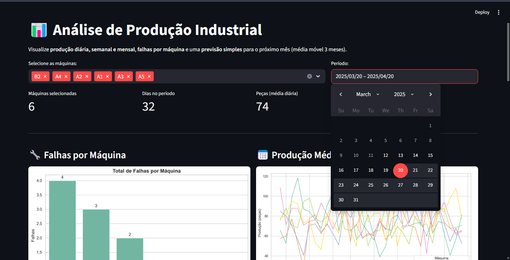
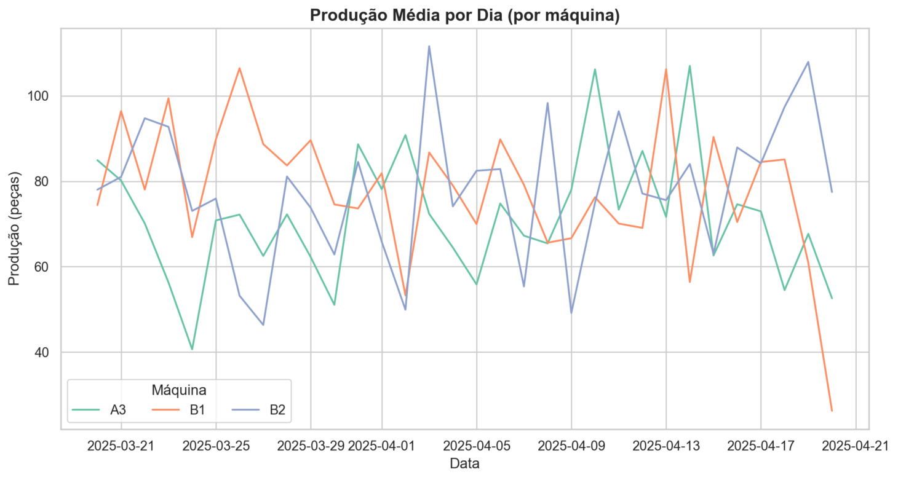
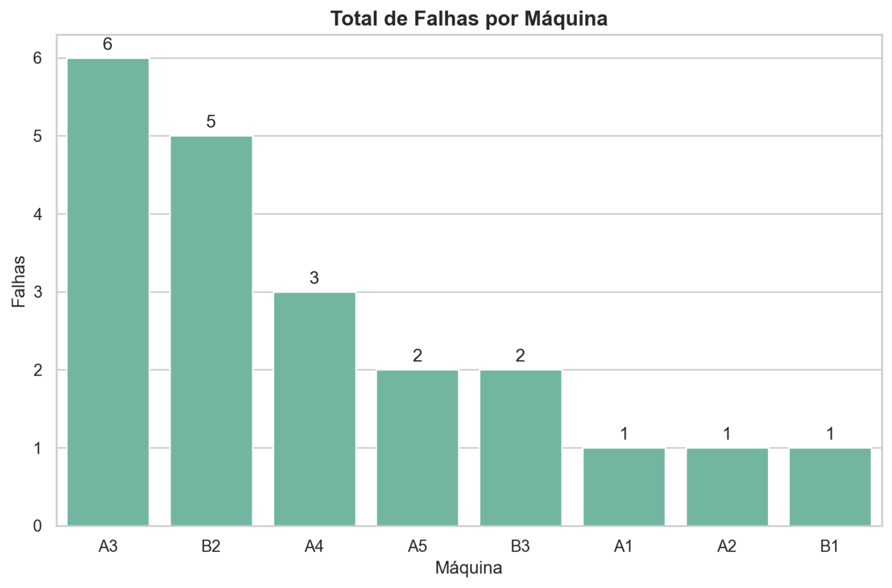
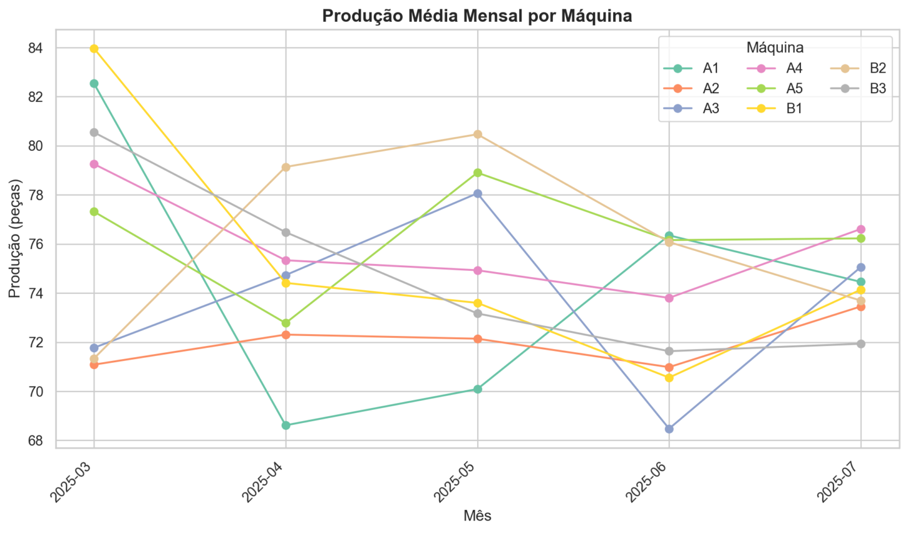
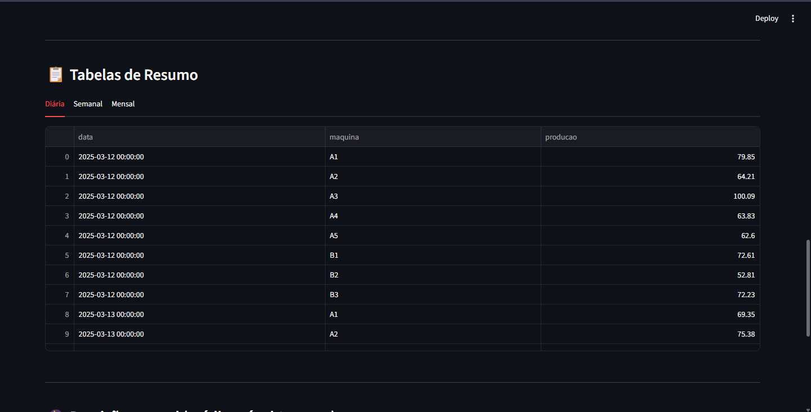
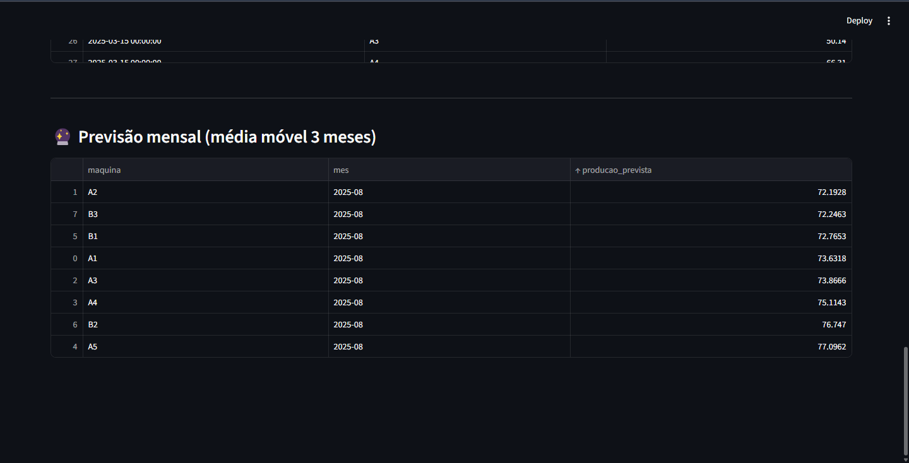

# 📊 Dashboard de Análise de Produção Industrial

  
  
  
  
  
  


---

## 📌 Sobre o Projeto
Este projeto simula e analisa a **produção industrial** de diferentes máquinas, integrando um pipeline **ETL → Banco de Dados → Dashboard**.  

O objetivo é demonstrar como **dados industriais** podem ser gerados, tratados, armazenados em **SQLite** e visualizados em um **dashboard interativo com Streamlit**.  

🔎 Ideal para estudos de **engenharia de dados**, **análise estatística** e **visualização de KPIs industriais**.

---

## 🎯 Objetivos
- Gerar dados industriais **realistas** (produção, falhas, horários de funcionamento).  
- Tratar e armazenar dados em um **banco relacional SQLite**.  
- Criar análises estatísticas e **gráficos interativos**.  
- Disponibilizar tudo em um **dashboard web intuitivo** com Streamlit.  

---

## 🛠️ Tecnologias Utilizadas
- 🐍 **Python 3.10+**
- 📦 **Pandas, Numpy**
- 📊 **Matplotlib, Seaborn**
- 🗄️ **SQLite**
- 🚀 **Streamlit**
- 🔧 **ETL Pipeline**

---

## 🗂️ Estrutura do Projeto

```bash
📦 projeto-analise-industrial
├── 📂 src
│   ├── generate_data.py      # Gera dados simulados de produção
│   ├── producao.py           # ETL → trata dados e salva no SQLite
│   ├── analise.py            # Funções de análise e gráficos
│   ├── app_streamlit.py      # Dashboard interativo
│
├── 📂 data
│   ├── 📂 raw                # Dados brutos
│   │   └── producao_raw.csv
│   ├── 📂 processed          # Dados tratados
│   │   └── producao.db       # Banco SQLite
│
├── 📂 reports
│   ├── img/                  # Imagens e gráficos para o README
│   │   └── <!-- adicione aqui -->
│
├── requirements.txt          # Dependências do projeto
└── README.md                 # Documentação

#    Fluxo de Dados (ETL → Análise → Dashboard)

flowchart LR
    A[📄 generate_data.py] -->
    A --> B[🛠️ producao.py (ETL)]
    B --> C[(🗄️ SQLite: producao.db)]
    C --> D[📊 analise.py]
    D --> E[🚀 app_streamlit.py (Dashboard)]


## Instalação

# ▶️ Como Executar o Projeto

## 1️⃣ Clonar o Repositório
 git clone https://github.com/seu-usuario/    projeto-analise-industrial.git
cd projeto-analise-industrial

2️⃣ Criar e Ativar o Ambiente Virtual
python -m venv .venv
source .venv/bin/activate   # Linux/Mac
.venv\Scripts\activate      # Windows

3️⃣ Instalar Dependências
pip install -r requirements.txt

4️⃣ Executar o Pipeline ETL
python src/generate_data.py
python src/producao.py

5️⃣ Rodar o Dashboard
streamlit run src/app_streamlit.py


###🚀 Próximos Passos

[] Exportação de relatórios automáticos em PDF/Excel

[] Deploy do Streamlit na nuvem (Streamlit Cloud / Heroku)

[] Integração com dados em tempo real
## Autores

## 📸 Demonstração









[](https://www.linkedin.com/in/marco-pinheiro-34256b373/)


